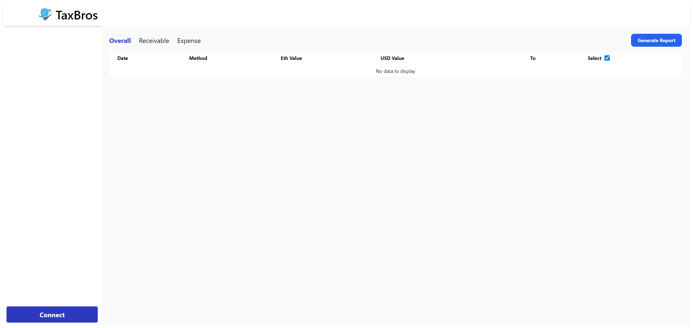
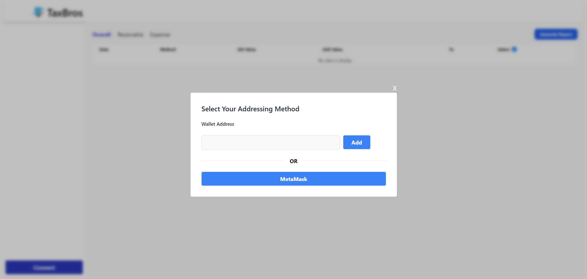
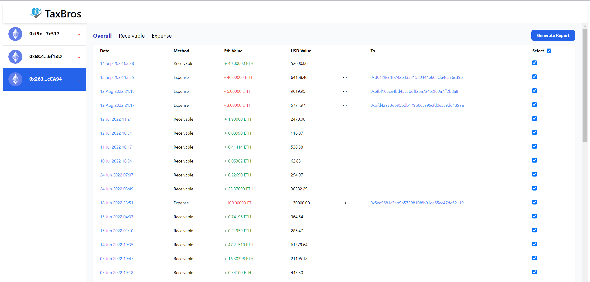
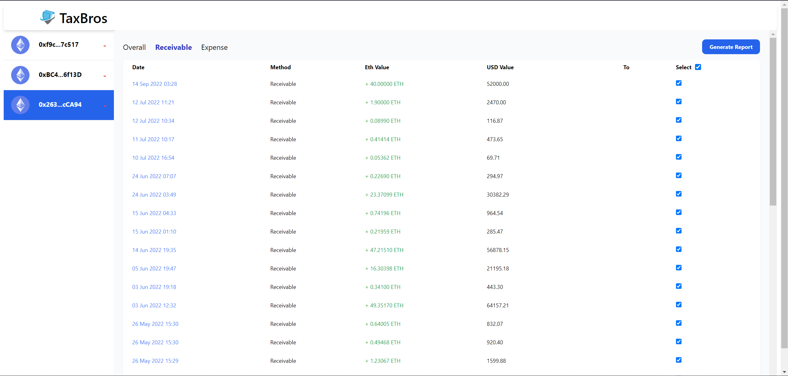
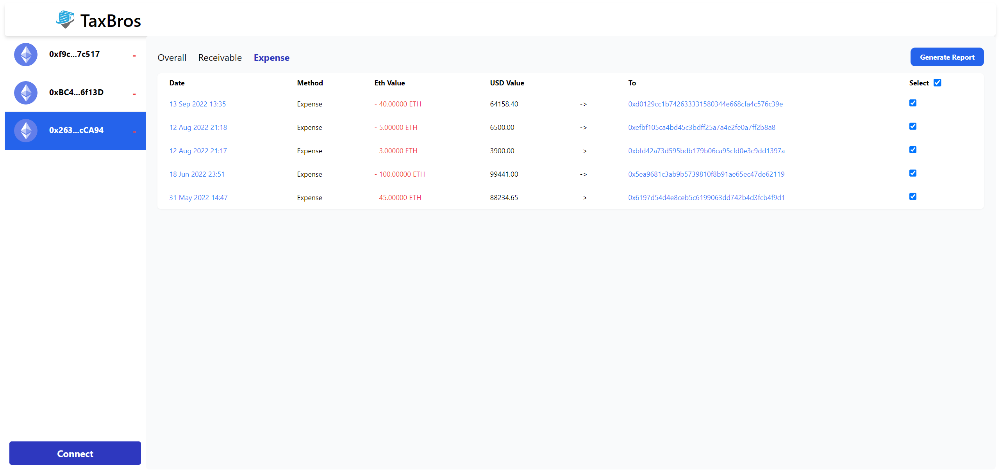
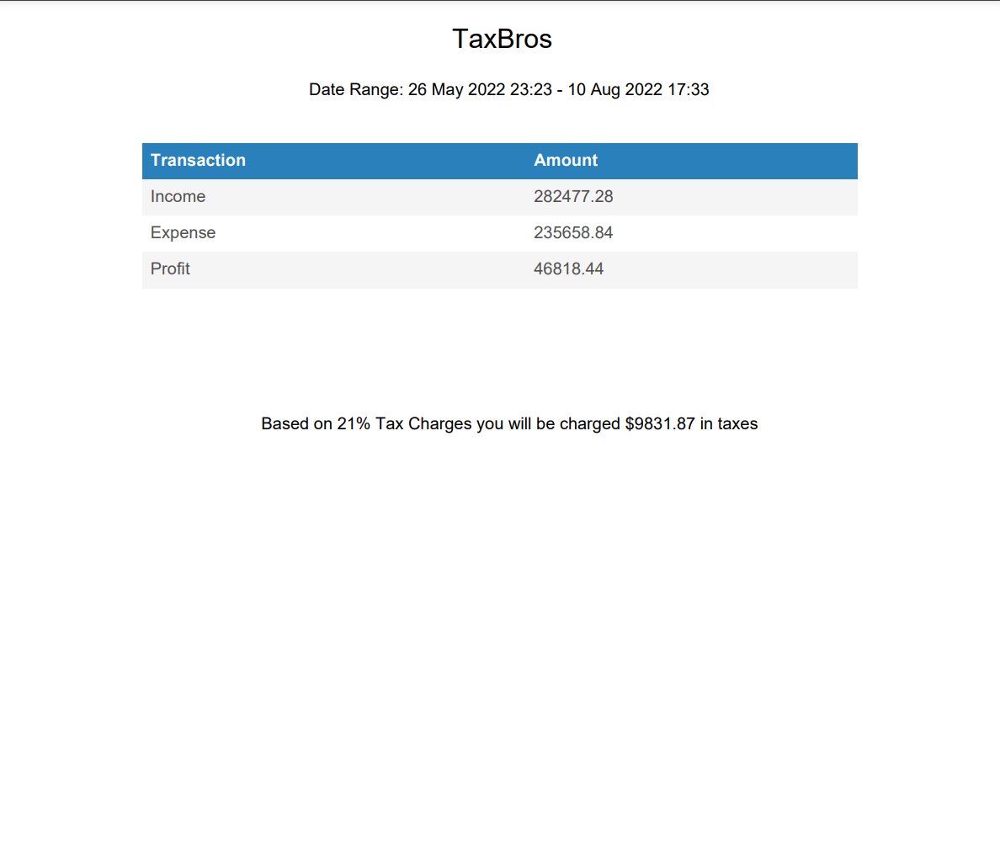

# TaxBros

## Demo

https://taxbros.vercel.app/

## About The Project

This project is done for **Crypto.com TheNextGen Hackathon 2022**. The problem statement that we are tackling is on how we might use Web3 to solve a business problem.

As the crypto trend grows, there are more and more companies looking to adopt cryptocurrencies payment into their ecosystem. However, they do not necessarily possess the technical knowledge to compute their transactions for taxing purposes. Therefore, TaxBros is a one-stop solution in helping these companies to get all their crypto transactions and calculate and generate their taxes for them.

## Preview








## Getting Started

<hr/>
This is an example of how you can set up your project locally. To get a local copy up and running follow these simple example steps.

```

Clone the repo with any
git clone with HTTPS https://github.com/ScorpiusSigma/TaxBros.git
git clone with SSH git@github.com:ScorpiusSigma/TaxBros.git
git clone with Github CLI gh repo clone ScorpiusSigma/TaxBros

Development

1. Open the project in your preferred editor
2. npm install
3. npm run dev
```
